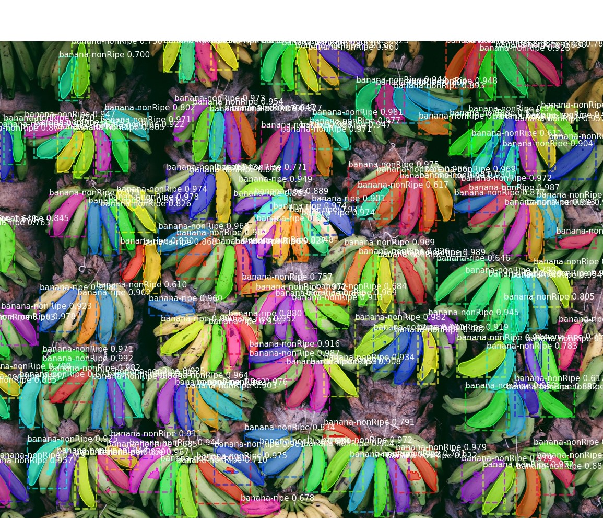
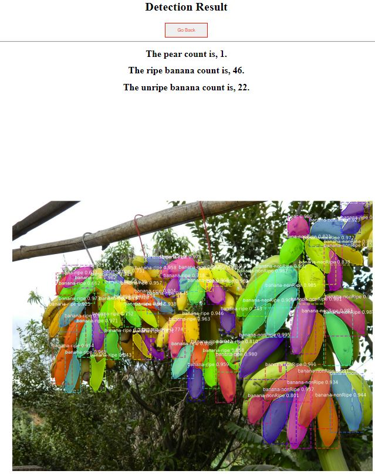

# Mask R-CNN for Fruit Detection and Segmentation

This is an [implementation](https://github.com/matterport/Mask_RCNN) of [Mask R-CNN](https://arxiv.org/abs/1703.06870) on Python 3, Keras,TensorFlow and Flask. 

The model generates bounding boxes and segmentation masks for each instance of an object in the image. It's based on Feature Pyramid Network (FPN) and a ResNet101/ResNet50 backbone. The flask provides a simple RESTful API to users, so users can run the  detection on pre-trained model easily via a simple website. 



## Honour Original Work
The implementation of the MASK RCNN framework is written by Matterport , his work is honoured. 
```
@misc{matterport_maskrcnn_2017,
  title={Mask R-CNN for object detection and instance segmentation on Keras and TensorFlow},
  author={Waleed Abdulla},
  year={2017},
  publisher={Github},
  journal={GitHub repository},
  howpublished={\url{https://github.com/matterport/Mask_RCNN}},
}
```

## Requirements
- Python 3.6.8
- TensorFlow 1.14-gpu
- Keras 2.1.3.
- Flask

Other common packages listed in `requirements.txt`.


## Step-by-step Installation Guide
1. Clone this repository to your desired local project directory

    ```
    YOUR_PROJECT_DIR
    └── Mask_RCNN
    ```

2. If you have a Nvidia GPU, it is **compulsory** to install a GPU version of TensorFlow in order to run this repo. To install, issue the command shown below. Please also follow step 3 and 4 to setup your graphic card. 

    ```bash
      pip install tensorflow-gpu==1.14
    ```

   If you don't have a Graphic Card, simply install TensorFlow via

    ```bash
      pip install tensorflow==1.14
    ```

3. **[Follow only If you have a GPU card]**Go to the [Nvidia Website](https://developer.nvidia.com/cuda-10.0-download-archive), Follow the instructions to install CUDA Toolkit 10.0 Archive. 

   1. Note that you may need to install Microsoft Visual Studio 2017 if the installation program asks.
   
4. **[Follow only If you have a GPU card]**Download [cuDNN v7.6.5 (November 5th, 2019), for CUDA 10.0](https://developer.nvidia.com/rdp/cudnn-download#a-collapse765-10)] zip file and unzip it to a folder. 

    1. Copy all the cuDNN components to `C:\Program Files\NVIDIA GPU Computing Toolkit\CUDA\v10.0 ` 

    2. Copy the unzipped cuda folder to `C:\tools`, so that cuda exists at `C:\tools\cuda` 

    3. **[IMPORTANT]** Setup path of Toolkit, otherwise TensorFlow-gpu will not be able to run. 

       Issue the following command in the terminal:

       ```
       SET PATH=C:\Program Files\NVIDIA GPU Computing Toolkit\CUDA\v10.0\bin;%PATH%
       SET PATH=C:\Program Files\NVIDIA GPU Computing Toolkit\CUDA\v10.0\extras\CUPTI\libx64;%PATH%
       SET PATH=C:\Program Files\NVIDIA GPU Computing Toolkit\CUDA\v10.0\include;%PATH%
       SET PATH=C:\tools\cuda\bin;%PATH%
       ```

5. Restart the computer. Test that GPU Toolkit is ready for TensorFlow. 

   1. **[Follow only If you have a GPU card]**Issue the command `nvcc -V` to verify CUDA and cuDNN installation, you should see the version of your CUDA tools. 
       

   2. If you encountered any error, please reinstall again. Here are some useful Tutorials to help to install the TensorFlow, CUDA and cuDNN. 

       1. [[Useful Configuration Tutorial]](https://tensorflow-object-detection-api-tutorial.readthedocs.io/en/latest/install.html)  

          [[Tutorials1]](https://www.tensorflow.org/install/gpu) 

          [[Tutorial2]](https://docs.nvidia.com/deeplearning/sdk/cudnn-install/index.html#install-windows) 

6. Test You can start the TensorFlow-GPU or normal TensorFlow without errors by issue the command in `Python` 

    ```bash
       import tensorflow as tf
       hello = tf.constant('Hello, TensorFlow!')
       sess = tf.Session()
       print(sess.run(hello))
    ```
       

7. Then install Keras v2.1.3, flask via pip command

   ```bash
   pip install keras==2.1.3
   pip install Flask
   ```

8. Navigate to the Mask RCNN folder, Install dependencies

   ```bash
   pip3 install -r requirements.txt
   ```

9. Run setup from the repository root directory
    ```bash
    python3 setup.py install
    ```

10. ***Download the pretrained model*.**

    1. [resnet50-3class](https://drive.google.com/file/d/1-ZBn02Bxd4JGjKUyDH4vEjb8eQufm9IZ/view?usp=sharing) 
    
        [resnet101-2class](https://drive.google.com/file/d/1eK5h15d-E2CTFBRACfAJAsZbXsgcoB2o/view?usp=sharing) 
    
        [resnet101-3class](https://drive.google.com/file/d/1dvjg7xk1PTWeawwifY8UdLkxljBjFb5T/view?usp=sharing) 
    
    2. Create a folder named logs under the Mask_RCNN root directory
    
    3. Unzip the downloaded models to `Mask_RCNN/logs`
    
    4. Resultantly, your project directory should looks like below:

```
Mask_RCNN
    ├── assets  //images for README
    ├── Provided_test_images //provided images for users to detect.
    					   //Users can choose other image if they wish 
    ├── logs							
    |   └── res50-3class  
    |   |   └── mask_rcnn_fruit_0075.h5 //pre-trained model 
    |   └── res101-2class  
    |   |   └── mask_rcnn_fruit_0065.h5 //pre-trained model
    |   └── res101-3class  
    |   |   └── mask_rcnn_fruit_0062.h5 //pre-trained model
    ├── mrcnn     //The Mask_RCNN framework
    └── samples
        └── pearBanana
    |    |   |   └── static
    |    |   | 		└──images			//folder to store the detection result
    |    |   | 		|	└──detection_result.jpg
    |    |   | 		|	└──splash_result.jpg
       			    └──initializeImag	//contain an image to initialize the model
    |    |   |   └── upload_images		//folder to store the uploaded image by users
    |    |   |   └──app-2class.py		//server 1 to start detection on 2 classes 
    |    |   |   └──app-3class.py		//server 2 to start detection on 3 classes
    |    |   |   └──app-resnet50-3class.py	//server 3 detect 3 classes using resnet50 backbone
    |    |   |   └──fruit.py			//training script
    |    |   |   └──fruit3class.py		//training script
    |    |   |   └──5 htmls pages		//webpage used for Flask Server
    
```

# Starting the server

```bash
$ cd DIR_TO_YOUR_PROJECT/MASK_RCNN/samples/pearBanana
$ python3 app-2class.py		//if you want to detect pear and banana
$ python3 app-3class.py		//if you want to detect pear, ripe banana and nonripe banana
$ python3 app-resnet50-3class.py //if you want to detect pear, ripe banana and nonripe banana,using resnet50 backbone
```

Setting up the server can take a while as it has to initialize the model, usually it takes up to 1 minute. Please be patient. If you see the following outputs from the console, the server has been set up successfully.


## Usage

1. Open a web browser and visit `http://127.0.0.1:5000/`

2. Click The `Detect` button if you wish to run standard fruit detection. If you would like to apply a colour splash effect, click the `Splash` button.
3. Click `Choose File` button to chose a 'jpg' image, then upload the image to model via `Upload and Detect`button. Wait for the computer to run the detection/colour-splash.
 
   1. It is highly recommend that you have a GPU card to use this repo. Otherwise the detection can be extremely slow. 
   2. Note that depends on the image quality, numbers of potential fruit objects in image and your computational power, the Duration of detection can vary greatly. It can take from 30 seconds at minimum, it can also take up to 10 minutes if you detect a high quality & high fruit density image on a less powerful GPU. 
4. The detection result will be shown on the output web page.
 
     1. You can also manually inspect the result from the 'MASK_RCNN/samples/pearBanana/static/images'. The 'detection_result.jpg' is the output of your standard detection. The 'splash_result.jpg' is the output of your colour splash detection.  The console also provides some useful information about the image.
 

5. If you wish to detect another image, click the`Go Back` to return to the homepage. Then select the desired method to run detection again. 

## Note

This app was developed for COMP90055 Research Project supervised by Prof. Richard Sinnott.

Author of the project:

- Chengsheng Wang